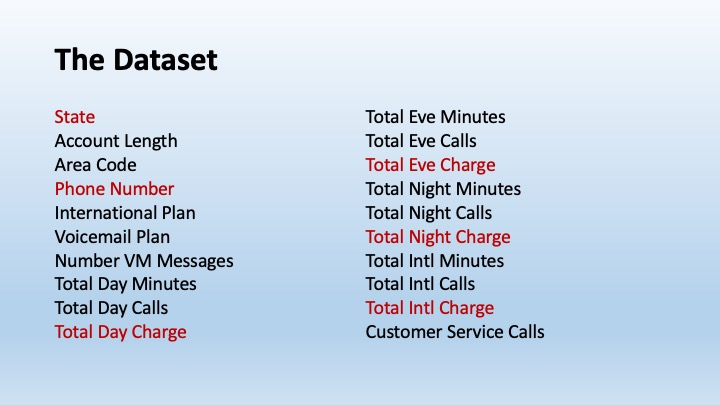
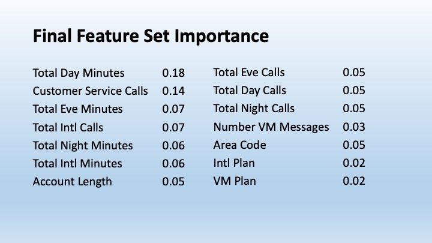
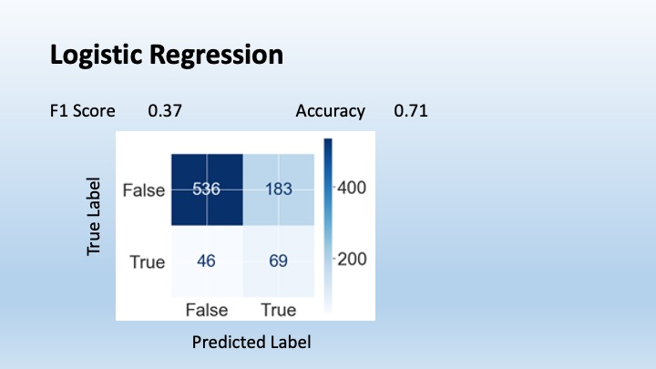
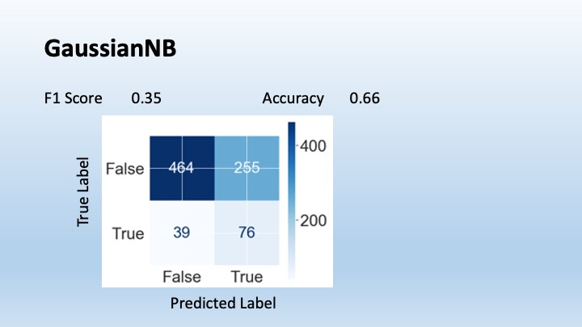
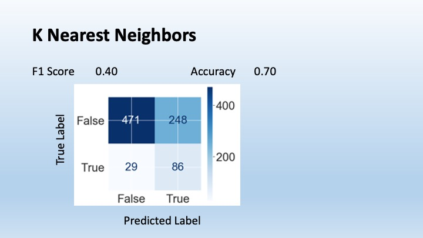
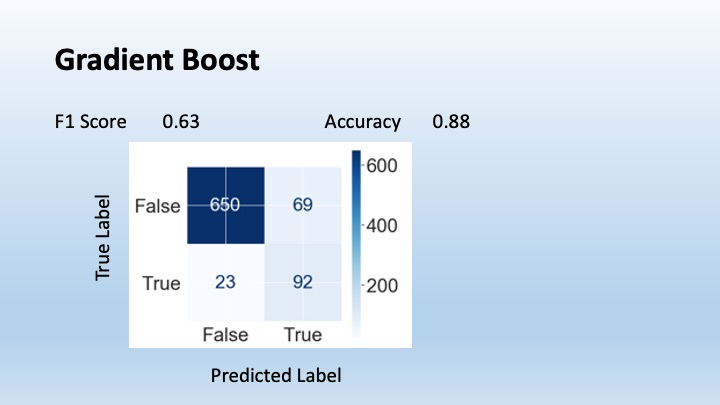

# Identifying Customer Churn

The goal of this project was to create a binary classification model to determine which customers are likely to leave the telecom company. Once customers are identified, the customer service team will contact them proactively to determine why they might leave. Resulting strategies to lower churn could include addressing individual customer concerns by customer service or general engineering improvements or sales policy changes.
To identify general improvements, it is not necessary to identify every churn instance, only enough to get sufficient customer feedback.

# The Dataset

The dataset contained 20 features. The columns in red were dropped because of low relevance (State, Phone Number) and correlation with other columns (eg Total Day Charges had a perfect correlation with Totaal Day Minutes since the charge is based on the Total Day Minutes). 

# Final Feature Set Importance

Two features stood out as being most important: Total Day Minutes and Customer Service Calls. Both make sense as heavy users and those interacting with customer service are likely to be the users experiencing the most problems, and therefore the most dissatisfaction. 

# Evaluation Criteria

I built six models to determined the best predictor of customer churn. The models were evaluated on:

F1 Score - a measure of both precision (true positives/predicted positives) and recall (predicted true positives/actual true positives)

Accuracy - the total number of predictions the model gets correct

Confusion Matrix - shows True Negatives, False Positives, False Negatives, True Positives

The confusion matrix will be the most important criterion. Since the goal of this project is to identify potential churn customers and contact them to determine the reason for their dissatisfaction, we don't need to talk to every single one to determine the main reasons for churn. The assumption here is that the reasons for churn are not unique to each customer but rather shared among many customers. It is important that those customers we do speak with are likely to leave, so that the reasons for dissatisfaction that we identify are the reasons customers leave. So the evaluation will focus on the true positive to false positive ratio for each model.

# Logistic Regression Model

The first model considered is a logistic regression model. It had a low F1 Score (a 0.37 in a range of 0-1.0) and an accuracy of 0.71. Most importantly, the majority of the predicted positives are false positives (the upper right corner of the confusion matrix) rather than true positives (lower right of the confusion matrix). It leaves plenty of room for improvement.

# GaussianNB Model

The second model considered is a GaussianNB model. Its F1 Score is not much better. its accuracy is lower, and it has more false positives.

# KNN Model

The third model considered is a K Nearest Neighbor model, and its performance was similar to the first two.

# Gradient Boost Model

Here we see some improvement. The number of false positives, 69 is less than the number of true positives, and that is reflected in higher F1 and Accuracy scores.

# Random Forest Model

The Random Forest Model is better still. There is a better true positive to false positive ratio than the Gradient Boost Model.

# XGBoost Model

Finally, we have the XGBoost model which has the best ratio of true positives to false positives, along with the best F1 and Accuracy scores.

# Conclusions

The XGBoost model gives the best predictive model, with an F1 Score of 0.75 and an accuracy score of 0.93.

The model gives more false positives than negatives, which is preferred as it emphasizes capturing as much churn as possible.

The two most important features for predicting churn are the total number of day minutes used and the number of customer service calls.

